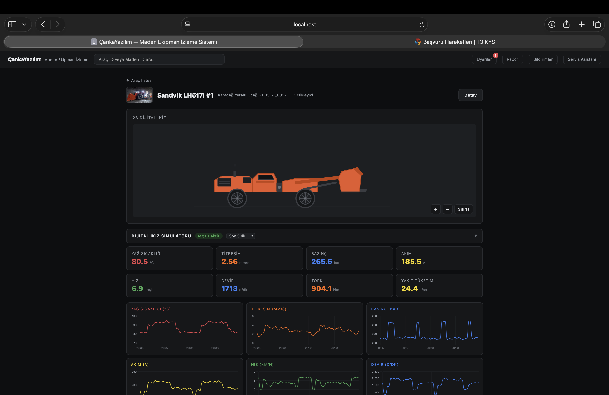
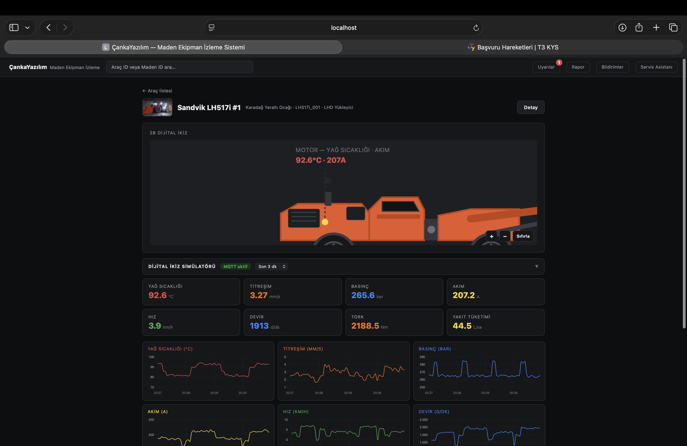
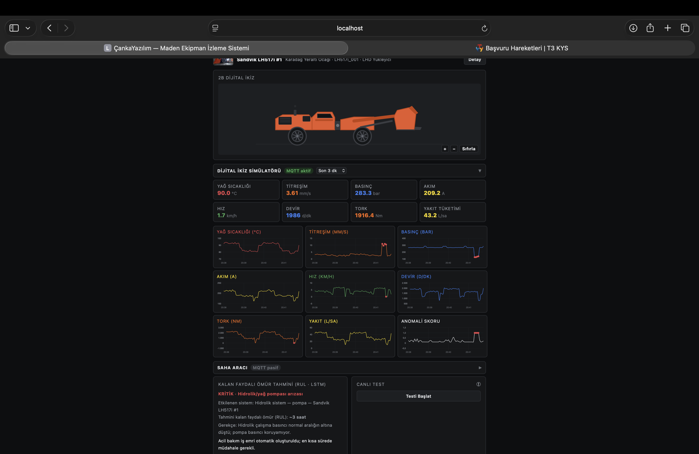
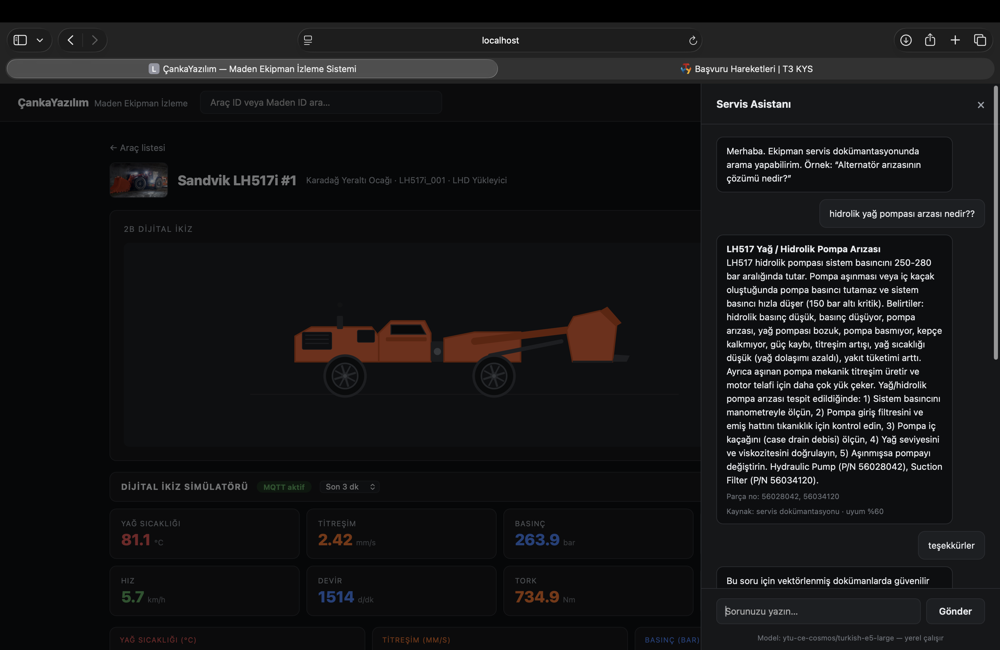
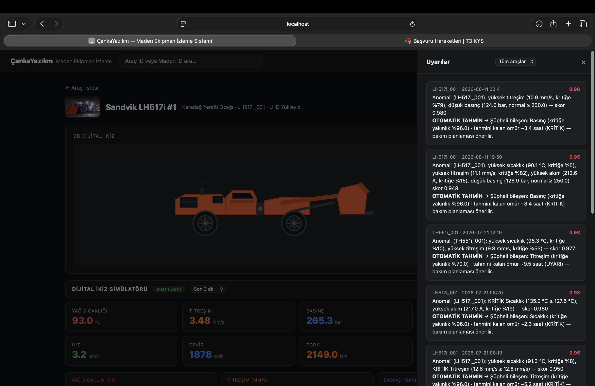
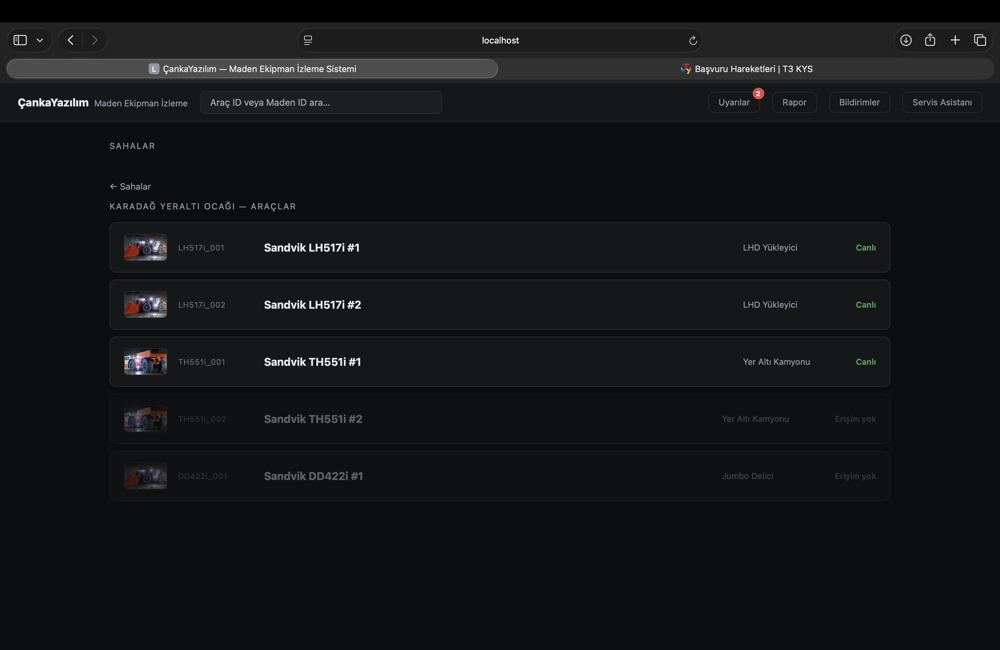
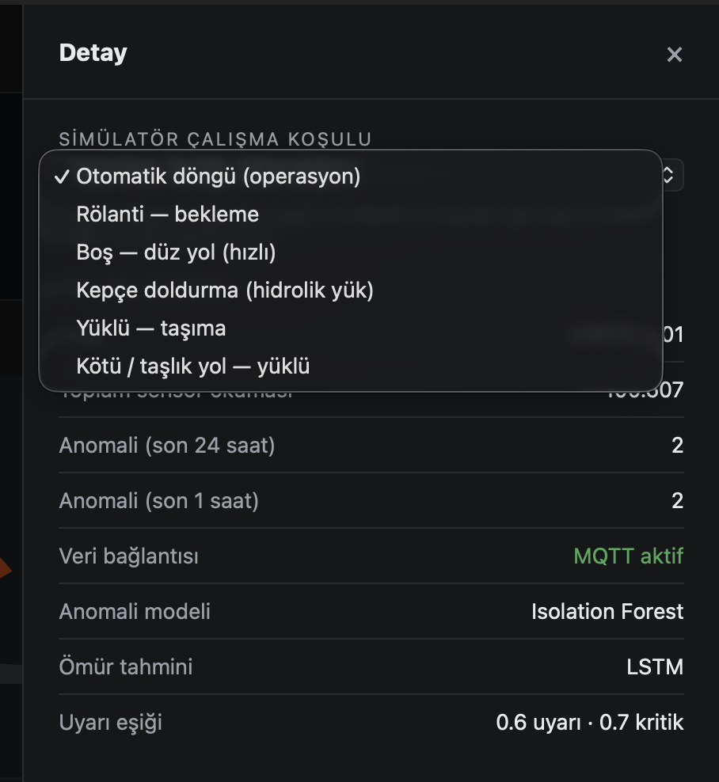
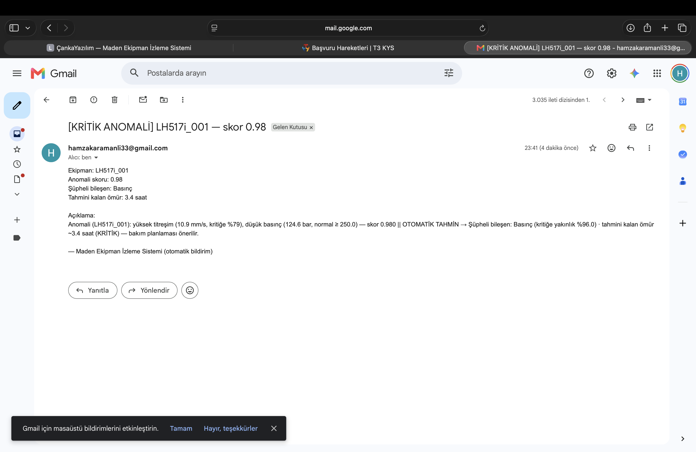
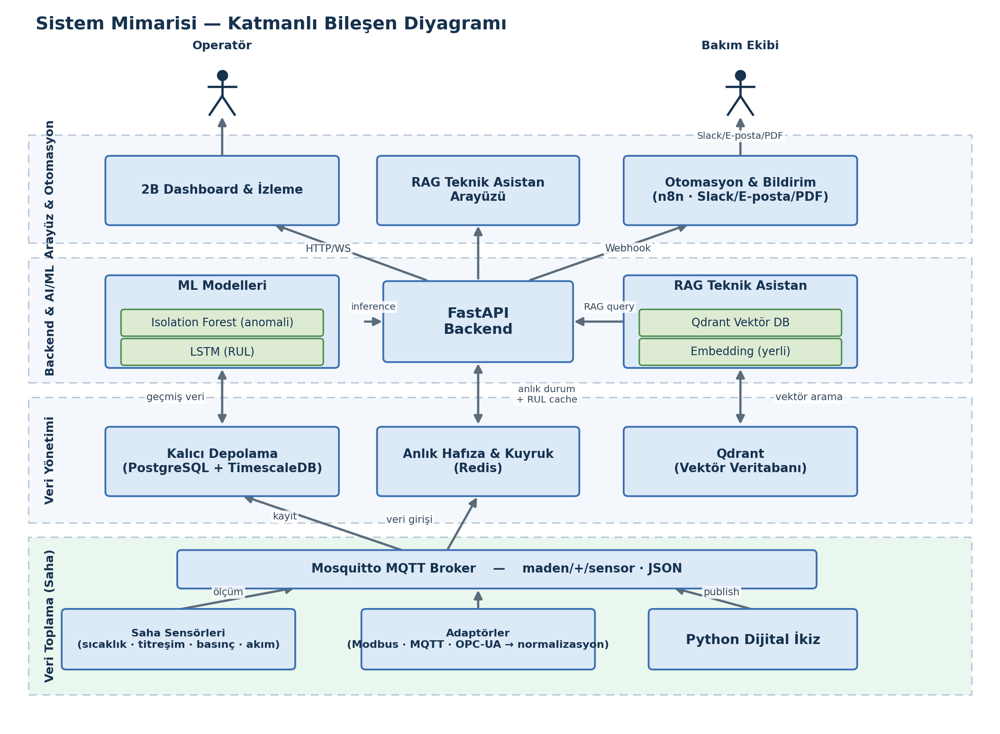

<div align="center">


# AI-Powered Mining Equipment Monitoring and Failure Prediction System

**A digital-twin based predictive maintenance platform for heavy mining equipment**

Anomaly detection · Remaining useful life prediction · RAG technical assistant · Autonomous action

[](https://www.python.org/)
[](https://fastapi.tiangolo.com/)
[](https://www.docker.com/)
[](#why-it-matters)

📄 **[Technical & Commercial Report (EN)](docs/report/CankaYazilim_Technical_Commercial_Report_EN.pdf)** · **[Teknik ve Ticari Rapor (TR)](docs/report/CankaYazilim_Teknik_Ticari_Rapor_TR.pdf)** · 🇹🇷 **[Türkçe README](README.tr.md)**

</div>

---

## Overview

In underground mining, heavy equipment is the backbone of the operation — yet its health is still managed
reactively: intervention happens only *after* a failure. This carries three costs: maintenance expenditure
that can reach **60% of total production cost**, roughly **2.5 TB of sensor data generated per machine per
day of which only ~1% is used**, and equipment-related accidents that account for **more than 40% of the
most severe injuries** in underground mining.

This system continuously monitors heavy equipment on a **digital twin**, predicts failures *before* they
occur, and delivers the corrective procedure to the operator instantly. Unlike passive monitoring
dashboards — what the literature calls a *digital shadow* — it does not merely display data: it converts
data into a decision and triggers an automated action chain.

> **Status:** working end-to-end prototype. Semi-finalist, TEKNOFEST 2026 Mining Technologies Competition.

## Why it matters

| | |
|---|---|
| **0.00%** | False alarm rate across 2,250 readings under normal operating conditions |
| **100%** | Detection rate across 480 fault events (8 failure types × 3 machines) |
| **$0** | Software licence cost — the entire stack is open source / fair-code |
| **On-premise** | Runs fully inside your own infrastructure; data never leaves the operation |

## Key capabilities

- **Real-time anomaly detection** — an unsupervised Isolation Forest per machine, calibrated to a 0–1
  score, with a consecutive-confirmation rule that eliminates noise spikes.
- **Remaining useful life (RUL) prediction** — an LSTM regressor over a 20-step × 5-feature window,
  producing an hour-scale estimate with planned (<24 h) and urgent (<8 h) maintenance thresholds.
- **RAG technical assistant** — manufacturer service manuals embedded into a Qdrant vector database;
  natural-language questions are answered from source documentation. Below the similarity threshold the
  system says *"no reliable match found"* rather than hallucinating.
- **Autonomous action** — critical anomalies trigger an n8n workflow that sends a notification, generates a
  PDF report and writes a system log entry in parallel.
- **Vendor independent** — adapts to mixed-brand fleets with configuration changes only, no architectural
  rework.
- **Physics-grounded digital twin simulator** — models real operating ranges from manufacturer
  specifications, with correlated sensors, wear accumulation and measurement noise.

## Screenshots

| Live monitoring dashboard | 2D digital twin (component level) |
|---|---|
|  |  |
| Real-time sensor cards and time-series charts. Anomalies are marked on the affected sensor's chart. | Level of detail increases as you zoom; the faulty component is highlighted on the schematic. |

| Anomaly + RUL prediction | RAG service assistant |
|---|---|
|  |  |
| The failure, affected system, estimated remaining life and recommended action. | A natural-language question answered from service documentation, with part numbers. |

| Alerts panel | Fleet / site selection |
|---|---|
|  |  |
| Detected anomalies with scores and the automatically generated prediction. | Multi-site, multi-machine, vendor-independent fleet monitoring. |

| Simulator operating conditions | Automated e-mail notification |
|---|---|
|  |  |
| Physical operating-condition scenarios of the digital twin. | A real notification dispatched by the automation chain. |

## Architecture

<div align="center">

</div>

Five microservice layers, all packaged with Docker Compose:

```
Field sensors / simulator
        │  Modbus · OPC-UA · MQTT  →  normalised JSON
        ▼
Eclipse Mosquitto (MQTT broker)
        ▼
Subscriber service ──┬──▶ TimescaleDB   (persistent time series)
                     ├──▶ Redis         (live latest state)
                     └──▶ Anomaly detection → RUL → n8n automation
        ▼
FastAPI backend  ──▶  Qdrant (vector DB, RAG)
        ▼
Browser dashboard · 2D digital twin · RAG assistant
```

| Layer | Component | Role |
|---|---|---|
| Runtime | Python 3.12, FastAPI, Uvicorn | Asynchronous REST services |
| Time series | TimescaleDB (PostgreSQL) | Persistent sensor history |
| Cache | Redis | Live latest state for the UI |
| Vector DB | Qdrant | Semantic search over service docs |
| Messaging | Eclipse Mosquitto (MQTT 3.1.1) | Real-time field data path |
| ML | scikit-learn, PyTorch | Isolation Forest, LSTM |
| Automation | n8n | Notification, PDF report, logging |
| Packaging | Docker, Docker Compose | Single-command deployment |

## Quick start

**Requirements:** Docker Desktop and Python 3.12.

```bash
git clone https://github.com/krmnlhmza/AI-Powered-Mining-Equipment-Monitoring-and-Failure-Prediction-System.git
cd AI-Powered-Mining-Equipment-Monitoring-and-Failure-Prediction-System/digital-twin

cp .env.example .env          # adjust credentials and notification recipients
docker compose up -d          # TimescaleDB, Redis, Qdrant, Mosquitto, n8n

python -m venv .venv && source .venv/bin/activate
pip install -r requirements.txt
python -m uvicorn main:app --port 8000
```

Then open **<http://localhost:8000>**.

> On first launch the embedding model is downloaded from Hugging Face (one-off, a few GB), so the first
> start takes longer than subsequent ones.

**Training the models** (optional — pre-trained models ship with the repository):

```bash
python ml/train.py            # Isolation Forest + LSTM + RUL models
```

## Repository layout

```
digital-twin/            Application
├── app/
│   ├── routers/         REST endpoints (sensors, anomalies, predict, rag, reports)
│   ├── services/        Anomaly detection, LSTM/RUL, RAG, mailer, n8n, PDF report
│   ├── adapters/        Modbus · OPC-UA · MQTT field adapters
│   └── models/          Database models
├── data/                Digital twin simulator and MQTT publisher
├── ml/                  Training scripts and trained models
├── static/              Browser interface
├── n8n_workflows/       Automation workflow definition
└── docker-compose.yml   Infrastructure services

docs/
├── report/              Technical & commercial report (TR / EN)
└── images/              Interface screenshots and diagrams
```

## Validation

Automated tests across three machines and all operating conditions:

| Test | Scope | Result |
|---|---|---|
| False alarms, normal operation | 2,250 sensor readings | **0** (0.00%) |
| Fault detection, event-based | 480 events, 8 fault types | **480** (100%) |
| End-to-end pipeline | Simulator → MQTT → DB → anomaly → RUL → assistant | 98,000+ readings, uninterrupted |
| Detection latency | 3 s publish interval, 3-reading confirmation | ~10 s from onset to notification |

> **Transparency:** these results were obtained on physics-grounded simulation data derived from
> manufacturer specifications — not real field data. A production deployment requires retraining and
> re-validation on site-collected data. The architecture is designed so this can be done with a single
> command.

## Validated failure scenarios

Oil/hydraulic pump failure · Bearing wear · Engine overheating · Injector/combustion fault ·
Overcurrent (motor winding) · Brake overheating · Transmission failure · Cooling system failure

Each is modelled to produce simultaneous, physically consistent signatures across multiple sensors.

## Roadmap

- [ ] Field pilot — real sensor integration and retraining on site data
- [ ] Full ingestion of manufacturer service manuals into the vector database
- [ ] Migration to newer open-source embedding models with higher retrieval performance
- [ ] 3D digital twin visualisation
- [ ] Multi-tenant productisation with role-based access control

## Data & attribution

**Training data.** All sensor data used to train and validate the models is generated by the
physics-based digital twin simulator in [`digital-twin/data/simulator.py`](digital-twin/data/simulator.py),
anchored to real operating ranges from manufacturer specification sheets. Manufacturer documents
themselves are not redistributed here.

**External reference dataset.** [`predictive_maintenance.csv`](digital-twin/data/predictive_maintenance.csv)
is the *Machine Predictive Maintenance Classification* dataset by **shivamb** on Kaggle, derived from
the UCI *AI4I 2020 Predictive Maintenance Dataset* (Matzka, S., 2020), licensed **CC BY 4.0**.

It is **not used to train any model.** The only value taken from it is the realistic failure rate
(mean of the `Target` column, ≈ 3.4%), which calibrates the `contamination` parameter of the Isolation
Forest — see [`ml/train.py`](digital-twin/ml/train.py) → `_kaggle_failure_rate()`.

Full details: [`digital-twin/data/DATA_SOURCES.md`](digital-twin/data/DATA_SOURCES.md)

## Contact

**Muhammed Hamza KARAMANLI** — Team Lead and Project Manager, ÇankaYazılım

📧 hamzakaramanli33@gmail.com · hamzakaramanli2011@outlook.com

For pilot deployments, technology partnerships or a detailed technical evaluation, please get in touch.
A live demonstration can be provided on request.
