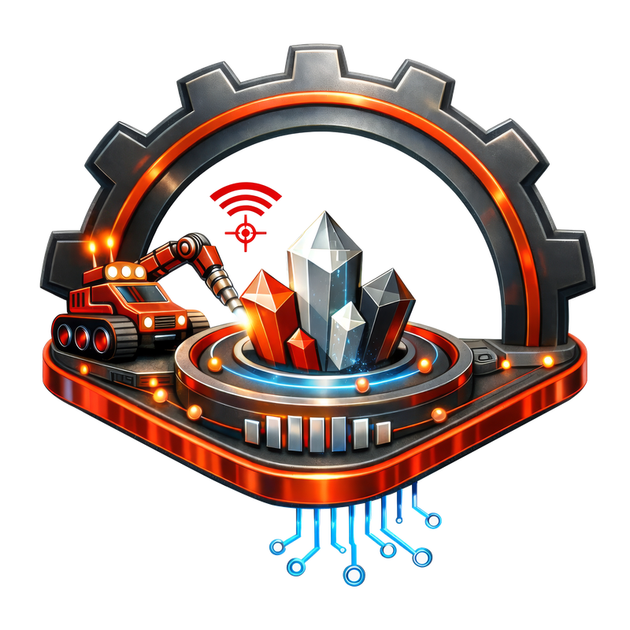

<div align="center">



# Yapay Zeka Destekli Maden Ekipmanı İzleme ve Arıza Tahmin Sistemi

**Ağır iş makineleri için dijital ikiz tabanlı kestirimci bakım platformu**

Anomali tespiti · Kalan faydalı ömür tahmini · RAG teknik asistan · Otonom aksiyon

📄 **[Teknik ve Ticari Rapor (TR)](docs/report/CankaYazilim_Teknik_Ticari_Rapor_TR.pdf)** · **[Technical & Commercial Report (EN)](docs/report/CankaYazilim_Technical_Commercial_Report_EN.pdf)** · 🇬🇧 **[English README](README.md)**

</div>

---

## Genel bakış

Yeraltı madenciliğinde ağır iş makineleri operasyonun can damarıdır; ancak bu makinelerin sağlığı hâlâ
büyük ölçüde reaktif yönetilmektedir: arızaya *gerçekleştikten sonra* müdahale edilir. Bunun üç bedeli
vardır: toplam üretim maliyetinin **%60'ına kadar çıkabilen bakım gideri**, makine başına günde üretilen
**~2,5 TB sensör verisinin yalnızca %1'inin kullanılabilmesi** ve yeraltındaki en ağır kazaların
**%40'tan fazlasının** ekipman kaynaklı olması.

Bu sistem, ağır iş makinelerini bir **dijital ikiz** üzerinde sürekli izler, arızayı *gerçekleşmeden önce*
tahmin eder ve çözümü operatörün önüne anında getirir. Pasif izleme panellerinden — literatürdeki adıyla
*dijital gölge* — farkı, veriyi yalnızca göstermek yerine bir karara dönüştürüp otomatik aksiyon zincirini
başlatmasıdır.

> **Durum:** uçtan uca çalışan prototip. TEKNOFEST 2026 Maden Teknolojileri Yarışması yarı finalisti.

## Neden önemli

| | |
|---|---|
| **%0,00** | Normal çalışma koşullarında 2.250 okumada yanlış alarm oranı |
| **%100** | 480 arıza olayında tespit oranı (8 arıza tipi × 3 makine) |
| **0 ₺** | Yazılım lisans maliyeti — tüm yığın açık kaynak / fair-code |
| **Kurum içi** | Tamamen kendi altyapınızda çalışır; veri işletmenin dışına çıkmaz |

## Temel yetenekler

- **Gerçek zamanlı anomali tespiti** — her makine için ayrı, denetimsiz Isolation Forest; 0–1 aralığına
  kalibre skor ve gürültü sıçramalarını eleyen ardışık teyit kuralı.
- **Kalan faydalı ömür (RUL) tahmini** — 20 adım × 5 özellik penceresi üzerinde LSTM regresör; saat
  cinsinden tahmin, planlı (<24 sa) ve acil (<8 sa) bakım eşikleriyle.
- **RAG teknik asistan** — üretici servis manuelleri Qdrant vektör veritabanına gömülür; doğal dil
  soruları kaynak dokümandan yanıtlanır. Benzerlik eşiğinin altında sistem cevap uydurmaz,
  *"güvenilir eşleşme bulunamadı"* der.
- **Otonom aksiyon** — kritik anomaliler n8n iş akışını tetikler: bildirim, PDF rapor ve sistem logu
  paralel üretilir.
- **Marka-bağımsız** — karışık markalı filolara yalnızca konfigürasyon değişikliğiyle uyarlanır, mimari
  değişiklik gerekmez.
- **Fiziğe dayalı dijital ikiz simülatörü** — üretici teknik dokümanlarındaki gerçek çalışma aralıklarını
  modeller; sensörler korelasyonlu, yıpranma birikimli ve ölçüm gürültülü.

## Ekran görüntüleri

| Canlı izleme panosu | 2B dijital ikiz (bileşen düzeyi) |
|---|---|
|  |  |
| Gerçek zamanlı sensör kartları ve zaman serisi grafikleri. Anomali anları ilgili sensörün grafiğinde işaretlenir. | Yakınlaştırıldıkça ayrıntı düzeyi artar; arızalı bileşen şema üzerinde işaretlenir. |

| Anomali + RUL tahmini | RAG servis asistanı |
|---|---|
|  |  |
| Arıza, etkilenen sistem, tahmini kalan ömür ve önerilen aksiyon. | Doğal dil sorusu ve servis dokümanından üretilen yanıt, parça numarasıyla. |

| Uyarılar bölümü | Filo / saha seçimi |
|---|---|
|  |  |
| Tespit edilen anomaliler, skorları ve otomatik üretilen tahmin. | Çok sahalı, çok makineli, marka-bağımsız filo izleme. |

| Simülatör çalışma koşulları | Otomatik e-posta bildirimi |
|---|---|
|  |  |
| Dijital ikizin fiziksel çalışma koşulu senaryoları. | Otomasyon zinciriyle gönderilen gerçek bildirim. |

## Mimari

<div align="center">

</div>

Beş mikroservis katmanı, tamamı Docker Compose ile paketli:

```
Saha sensörleri / simülatör
        │  Modbus · OPC-UA · MQTT  →  normalize JSON
        ▼
Eclipse Mosquitto (MQTT broker)
        ▼
Abone servisi ──┬──▶ TimescaleDB   (kalıcı zaman serisi)
                ├──▶ Redis         (canlı son durum)
                └──▶ Anomali tespiti → RUL → n8n otomasyonu
        ▼
FastAPI backend  ──▶  Qdrant (vektör veritabanı, RAG)
        ▼
Tarayıcı panosu · 2B dijital ikiz · RAG asistan
```

| Katman | Bileşen | Rol |
|---|---|---|
| Çalışma zamanı | Python 3.12, FastAPI, Uvicorn | Asenkron REST servisleri |
| Zaman serisi | TimescaleDB (PostgreSQL) | Kalıcı sensör geçmişi |
| Önbellek | Redis | Arayüz için canlı son durum |
| Vektör veritabanı | Qdrant | Servis dokümanlarında anlamsal arama |
| Mesajlaşma | Eclipse Mosquitto (MQTT 3.1.1) | Gerçek zamanlı saha veri hattı |
| Makine öğrenmesi | scikit-learn, PyTorch | Isolation Forest, LSTM |
| Otomasyon | n8n | Bildirim, PDF rapor, loglama |
| Paketleme | Docker, Docker Compose | Tek komutla kurulum |

## Hızlı başlangıç

**Gereksinimler:** Docker Desktop ve Python 3.12.

```bash
git clone https://github.com/krmnlhmza/AI-Powered-Mining-Equipment-Monitoring-and-Failure-Prediction-System.git
cd AI-Powered-Mining-Equipment-Monitoring-and-Failure-Prediction-System/digital-twin

cp .env.example .env          # kimlik bilgilerini ve bildirim alıcılarını düzenleyin
docker compose up -d          # TimescaleDB, Redis, Qdrant, Mosquitto, n8n

python -m venv .venv && source .venv/bin/activate
pip install -r requirements.txt
python -m uvicorn main:app --port 8000
```

Ardından **<http://localhost:8000>** adresini açın.

> İlk çalıştırmada gömme (embedding) modeli Hugging Face'ten indirilir (tek seferlik, birkaç GB); bu
> nedenle ilk açılış sonrakilerden uzun sürer.

**Modelleri eğitmek** (isteğe bağlı — eğitilmiş modeller depoda mevcuttur):

```bash
python ml/train.py            # Isolation Forest + LSTM + RUL modelleri
```

## Depo yapısı

```
digital-twin/            Uygulama
├── app/
│   ├── routers/         REST uçları (sensors, anomalies, predict, rag, reports)
│   ├── services/        Anomali tespiti, LSTM/RUL, RAG, mailer, n8n, PDF rapor
│   ├── adapters/        Modbus · OPC-UA · MQTT saha adaptörleri
│   └── models/          Veritabanı modelleri
├── data/                Dijital ikiz simülatörü ve MQTT yayıncısı
├── ml/                  Eğitim betikleri ve eğitilmiş modeller
├── static/              Tarayıcı arayüzü
├── n8n_workflows/       Otomasyon iş akışı tanımı
└── docker-compose.yml   Altyapı servisleri

docs/
├── report/              Teknik ve ticari rapor (TR / EN)
└── images/              Arayüz görselleri ve şemalar
```

## Doğrulama

Üç makine ve tüm çalışma koşulları üzerinde yürütülen otomatik testler:

| Test | Kapsam | Sonuç |
|---|---|---|
| Normal çalışmada yanlış alarm | 2.250 sensör okuması | **0** (%0,00) |
| Arıza tespiti (olay bazlı) | 480 olay, 8 arıza tipi | **480** (%100) |
| Uçtan uca akış | Simülatör → MQTT → veritabanı → anomali → RUL → asistan | 98.000+ okuma, kesintisiz |
| Tespit gecikmesi | 3 sn yayın aralığı, 3 okumalık teyit | Başlangıçtan bildirime ~10 sn |

> **Şeffaflık notu:** bu sonuçlar, üretici teknik değerlerine dayalı fiziksel simülasyon verisi üzerinde
> elde edilmiştir — gerçek saha verisi değildir. Gerçek bir kurulumda modellerin sahadan toplanan veriyle
> yeniden eğitilmesi ve doğrulanması gerekir. Mimari, bunu tek komutla yapacak şekilde tasarlanmıştır.

## Doğrulanmış arıza senaryoları

Yağ/hidrolik pompa arızası · Rulman aşınması · Motor aşırı ısınması · Enjektör/yanma arızası ·
Aşırı akım (motor sargı) · Fren aşırı ısınması · Transmisyon arızası · Soğutma sistemi arızası

Her biri, birden fazla sensörde eş zamanlı ve fiziksel olarak tutarlı imzalar üretecek biçimde
modellenmiştir.

## Yol haritası

- [ ] Saha pilotu — gerçek sensör entegrasyonu ve saha verisiyle yeniden eğitim
- [ ] Üretici servis manuellerinin tam kapsamlı olarak vektör veritabanına aktarılması
- [ ] Erişim başarımı daha yüksek, güncel açık kaynak gömme modellerine geçiş
- [ ] 3B dijital ikiz görselleştirmesi
- [ ] Rol tabanlı yetkilendirmeli, çok kiracılı ürünleşme

## Veri ve atıf

**Eğitim verisi.** Modelleri eğitmek ve doğrulamak için kullanılan tüm sensör verisi,
[`digital-twin/data/simulator.py`](digital-twin/data/simulator.py) içindeki fiziğe dayalı dijital ikiz
simülatöründen üretilir; üreticinin teknik dokümanlarındaki gerçek çalışma aralıkları esas alınmıştır.
Üretici dokümanlarının kendisi bu depoda dağıtılmamaktadır.

**Harici referans veri seti.** [`predictive_maintenance.csv`](digital-twin/data/predictive_maintenance.csv)
dosyası, Kaggle'da **shivamb** tarafından yayımlanan *Machine Predictive Maintenance Classification*
veri setidir; kaynağı UCI *AI4I 2020 Predictive Maintenance Dataset* (Matzka, S., 2020) olup
**CC BY 4.0** lisanslıdır.

Bu veri seti **hiçbir modeli eğitmek için kullanılmaz.** Ondan alınan tek bilgi, gerçekçi arıza oranıdır
(`Target` sütununun ortalaması, ≈ %3,4); bu oran Isolation Forest'ın `contamination` parametresini
kalibre eder — bkz. [`ml/train.py`](digital-twin/ml/train.py) → `_kaggle_failure_rate()`.

Ayrıntı: [`digital-twin/data/DATA_SOURCES.md`](digital-twin/data/DATA_SOURCES.md)

## İletişim

**Muhammed Hamza KARAMANLI** — Takım Kaptanı ve Proje Yöneticisi, ÇankaYazılım

📧 hamzakaramanli33@gmail.com · hamzakaramanli2011@outlook.com

Pilot uygulama, teknoloji iş birliği veya ayrıntılı teknik değerlendirme talepleriniz için iletişime
geçebilirsiniz. Sistemin canlı demosu talep üzerine sunulabilir.
